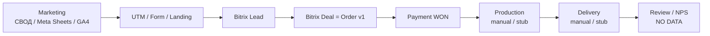
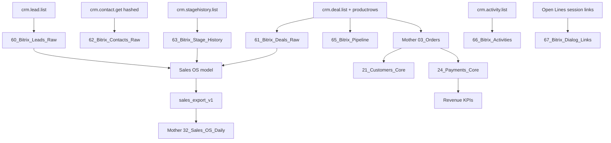
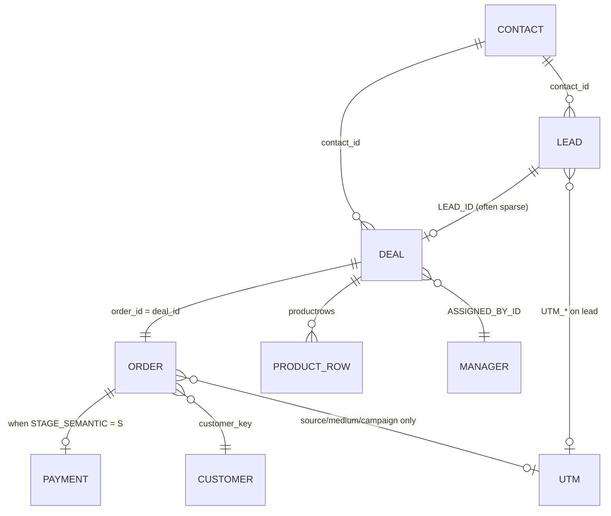
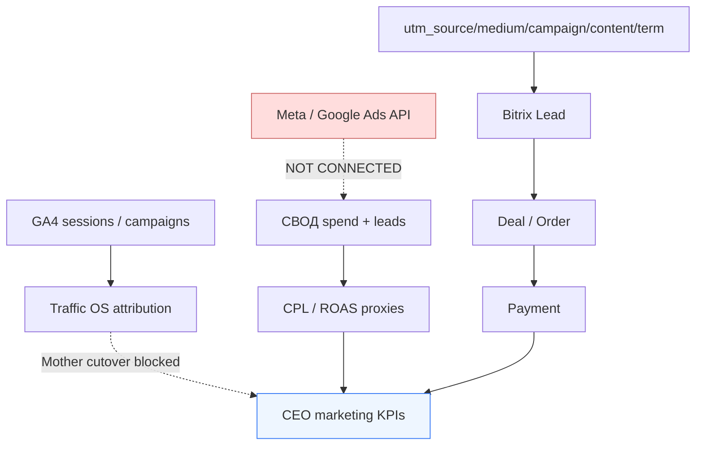
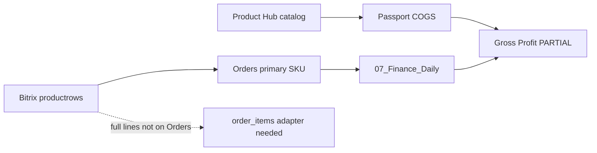
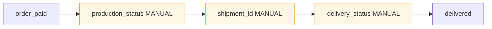
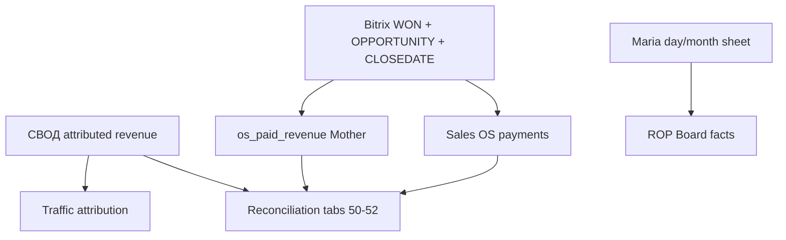

# Retro Pressa Analytics OS — Data Map

**Date:** 2026-08-08  
**Companion:** [analytics-os-audit.md](./analytics-os-audit.md) · [DATA_FLOW.md](./DATA_FLOW.md)

Mermaid diagrams below are supported in GitHub / most Markdown previews.

---

## 1. End-to-end business chain



**Breaks:** Ads API missing at MKT; UTM often empty on messengers; PROD/DEL/REV not automated.

---

## 2. System architecture (Business OS → Analytics OS)

```mermaid
flowchart TB
  subgraph Sources
    BX[Bitrix CRM]
    SVOD[СВОД Sheets]
    GA4[GA4 Data API]
    MARIA[Maria Truth Sheet]
    HUB[Product Hub Sheets]
    OL[Open Lines / Dialogs]
  end

  subgraph Warehouses
    SF[Sales Foundation<br/>Mother 60-69]
    SOS[Sales OS<br/>99_EXPORT]
    TOS[Traffic OS<br/>99_EXPORT v3]
    MOS[Mother OS<br/>Orders Customers Payments Finance]
  end

  subgraph App
    SNAP[Company Snapshot<br/>metrics-engine]
    AOS[Analytics OS UI<br/>/analytics — planned evolution]
    AD[/ad-analytics]
    ROP[/rop/conversations]
  end

  BX --> SF --> SOS
  SOS -->|dual-run| MOS
  BX -->|orders mapper| MOS
  SVOD --> TOS
  GA4 --> TOS
  GA4 --> AD
  TOS -.->|cutover BLOCKED| MOS
  MARIA --> SOS
  HUB -.->|partial COGS| SNAP
  OL --> ROP
  MOS --> SNAP --> AOS
  SOS --> AOS
  TOS --> AOS
```

---

## 3. Sales lineage (CRM money path)



---

## 4. Order identity & joins



### customer_key priority

```text
contact:{id}
  → phone:{sha256(normalized)}
  → email:{sha256(normalized)}
  → lead:{id}
  → deal:{id} / order:{id}
```

---

## 5. Marketing → sale join (current truthfulness)



| Hop | Strength |
|-----|----------|
| UTM → Lead | Strong when form/landing |
| Lead → Deal | Medium (conversion fields underfilled) |
| Deal → Payment | Strong (WON + CLOSEDATE) |
| Ad creative → Revenue | Weak (no Ads API id grain) |
| GA4 user → CRM person | Weak (see GA4_AUDIT) |

---

## 6. Product & finance joins



---

## 7. Operations gap map



Normative SLA exists in Product Hub `04_PRODUCTION_DELIVERY`; actual timestamps do not.

---

## 8. Conversations join

```mermaid
flowchart TD
  OL[Bitrix Open Lines]
  SNAP[data/conversation-snapshots]
  BOOK[Dialogs workbook bodies]
  IDX[Mother 08_Dialog_Export index only]
  LINK[67_Bitrix_Dialog_Links]
  CRM[Lead / Deal / Manager]
  GEM[.cache gemini analysis]
  ROPUI[/rop/conversations]

  OL --> SNAP
  OL --> BOOK
  BOOK --> IDX
  OL --> LINK --> CRM
  SNAP --> GEM --> ROPUI
  SNAP --> ROPUI
```

Join path for Conversation Intelligence:

```text
conversation (dialog_id)
  → dialog_links (lead_id / deal_id / manager_id / customer_key)
  → deal / order / payment
```

Bodies never enter Mother (ADR-003).

---

## 9. Country source-of-truth rules

| Priority | Field | Entity |
|----------|-------|--------|
| 1 (preferred for order money) | Deal `UF_CRM_6797B3DA00D16` → `country` | Order / Payment |
| 2 | Lead `UF_CRM_1737995147` | Fallback in orders-mapper |
| 3 | Contact country_raw | Weak / sparse |
| Avoid as money geo | GA4 country / IP | Marketing only |

**Rule for Analytics OS:** Country Revenue = Orders/Payments.country; Country CR may use lead.country for top-of-funnel with explicit label.

---

## 10. Dual-truth revenue map



Analytics OS must show **which truth** each KPI uses and surface reconciliation delta — never silently mix.

---

## 11. Recommended Analytics OS read path (Phase 1)

```text
UI /analytics
  ← company-snapshot facade (monthly/daily KPIs)
  ← Mother 03_Orders / 21_Customers / 24_Payments (via existing sync JSON or Sheets read helpers)
  ← Sales OS export / foundation stage history (funnel)
  ← Traffic OS export OR /ad-analytics APIs (marketing) — label PARTIAL if Mother blocked
  ← Finance 07 (plan/fact) with MANUAL badges
  ← Product Hub readiness (optional panel)
  ← Explicit NO DATA cards: production, refunds, reviews
```

No new database required for Phase 1 if Sheet/snapshot freshness SLA is acceptable.
